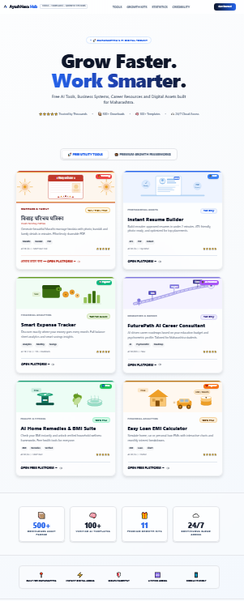
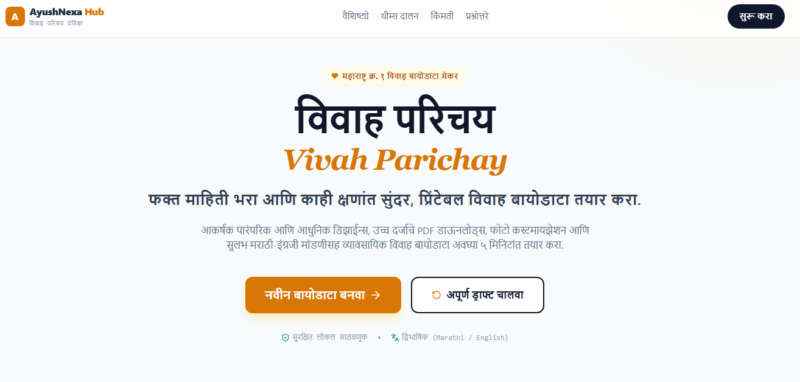
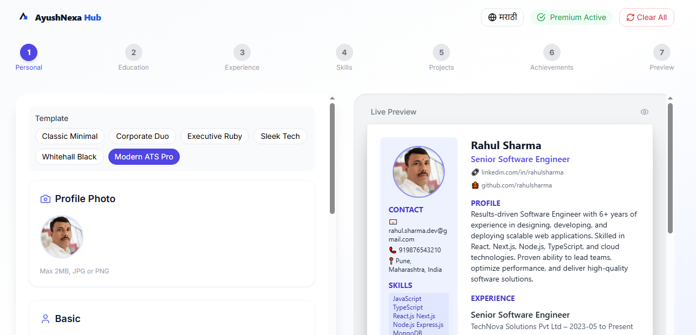
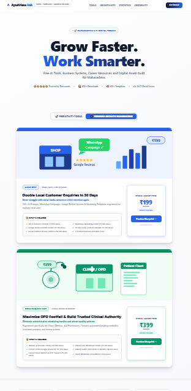
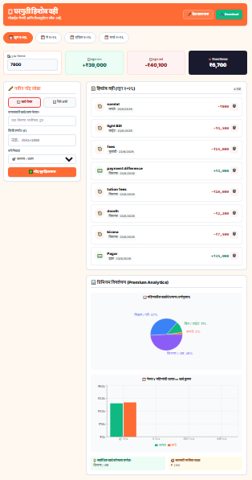

# 🚀 AyushNexa Hub

A multi-service SaaS platform designed to help students, professionals, and families through practical digital tools.

## 🌐 Live Demo

https://hub.ayushnexa.com

---

## ✨ Features

### 💍 Vivah Parichay Builder

Create professional marriage biodata PDFs instantly.

### 📄 Resume Builder

Generate ATS-friendly resumes with modern templates.

### 🎓 Career Guidance

Get career recommendations based on academic performance, interests, and goals.

### 💰 Expense Tracker

Track personal expenses and manage finances efficiently.

---

## 🛠️ Tech Stack

* Next.js
* React
* TypeScript
* Tailwind CSS
* Supabase
* PDF Generation
* AI Integration

---

## 🎯 Target Users

* Students
* Job Seekers
* Families
* Professionals
* Small Businesses

---

## 📱 Key Benefits

* Mobile Responsive
* Fast Performance
* PDF Downloads
* User Friendly Interface
* AI-Powered Features

---

## 🔗 Related Links

Website:
https://ayushnexa.com

Quick Nexa:
https://quick.ayushnexa.com

## 📸 Screenshots

### Home Page

### Vivah Parichay Builder

### Resume Builder

### Career Guidance

### Expense Tracker

---

## 👨‍💻 Developer

Avinash Kumar

Email:avinash@ayushnexa.com

GitHub:
https://github.com/kavibioinfo
